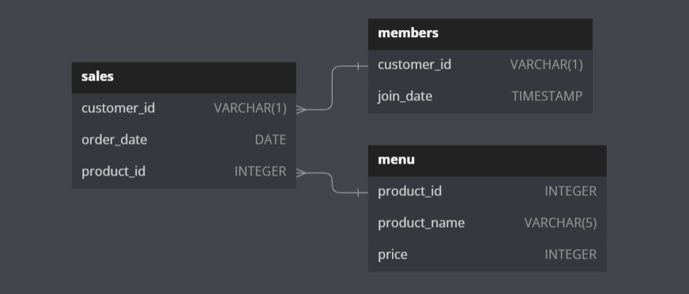
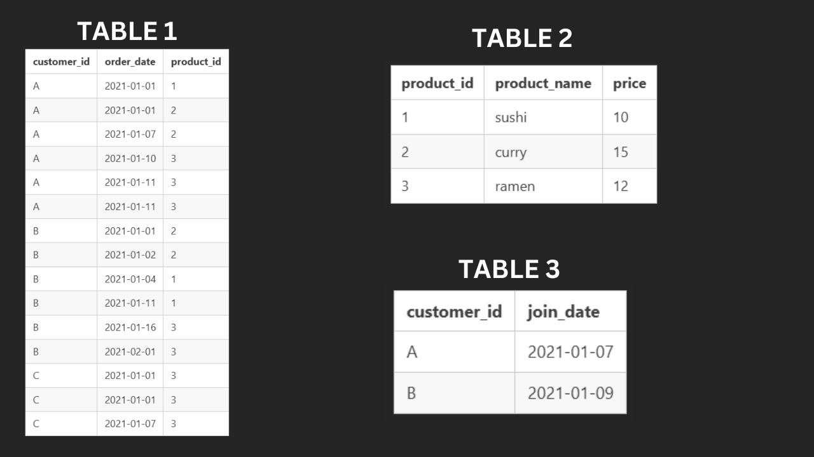

Thanks [Danny](https://www.datawithdanny.com/) for this amazing [case study](https://8weeksqlchallenge.com/case-study-1/)


## Introduction
Danny seriously loves Japanese food so in the beginning of 2021, he decides to embark upon a risky venture and opens up a cute little restaurant that sells his 3 favourite foods: sushi, curry and ramen.

Danny’s Diner is in need of your assistance to help the restaurant stay afloat - the restaurant has captured some very basic data from their few months of operation but have no idea how to use their data to help them run the business.

## Problem Statement
Danny wants to use the data to answer a few simple questions about his customers, especially about their visiting patterns, how much money they’ve spent and also which menu items are their favorite. Having this deeper connection with his customers will help him deliver a better and more personalized experience for his loyal customers.

He plans on using these insights to help him decide whether he should expand the existing customer loyalty program - additionally he needs help to generate some basic datasets so his team can easily inspect the data without needing to use SQL.

Danny has provided you with a sample of his overall customer data due to privacy issues - but he hopes that these examples are enough for you to write fully functioning SQL queries to help him answer his questions!

Danny has shared with you 3 key datasets for this case study:
- `sales`
- `menu`
- `members`

## Entity Relationship Diagram



## Example Datasets
### Table 1: sales
The `sales` table captures all `customer_id` level purchases with a corresponding `order_date` and `product_id` information for when and what menu items were ordered.

### Table 2: menu
The `menu` table maps the `product_id` to the actual `product_name` and `price` of each menu item.

### Table 3: members
The final `members` table captures the `join_date` when a `customer_id` joined the beta version of the Danny’s Diner loyalty program.



```sql
CREATE SCHEMA dannys_diner;
SET search_path = dannys_diner;

CREATE TABLE sales (
  "customer_id" VARCHAR(1),
  "order_date" DATE,
  "product_id" INTEGER
);

INSERT INTO sales
  ("customer_id", "order_date", "product_id")
VALUES
  ('A', '2021-01-01', '1'),
  ('A', '2021-01-01', '2'),
  ('A', '2021-01-07', '2'),
  ('A', '2021-01-10', '3'),
  ('A', '2021-01-11', '3'),
  ('A', '2021-01-11', '3'),
  ('B', '2021-01-01', '2'),
  ('B', '2021-01-02', '2'),
  ('B', '2021-01-04', '1'),
  ('B', '2021-01-11', '1'),
  ('B', '2021-01-16', '3'),
  ('B', '2021-02-01', '3'),
  ('C', '2021-01-01', '3'),
  ('C', '2021-01-01', '3'),
  ('C', '2021-01-07', '3');
 

CREATE TABLE menu (
  "product_id" INTEGER,
  "product_name" VARCHAR(5),
  "price" INTEGER
);

INSERT INTO menu
  ("product_id", "product_name", "price")
VALUES
  ('1', 'sushi', '10'),
  ('2', 'curry', '15'),
  ('3', 'ramen', '12');
  

CREATE TABLE members (
  "customer_id" VARCHAR(1),
  "join_date" DATE
);

INSERT INTO members
  ("customer_id", "join_date")
VALUES
  ('A', '2021-01-07'),
  ('B', '2021-01-09');
```

## Case Study Questions

### 1. What is the total amount each customer spent at the restaurant?

```sql
SELECT
	s.customer_id,
	SUM(m.price) AS total_amount
FROM
	sales s
	LEFT JOIN menu m ON s.product_id = m.product_id
GROUP BY
	s.customer_id
ORDER BY
	s.customer_id;
```

| customer_id | total_amount |
| ----------- | ------------ |
| A           | 76           |
| B           | 74           |
| C           | 36           |

---

### 2. How many days has each customer visited the restaurant?

```sql
SELECT
	customer_id,
	COUNT(DISTINCT order_date)
FROM
	sales
GROUP BY
	customer_id
ORDER BY
	customer_id;
```

| customer_id | count |
| ----------- | ----- |
| A           | 4     |
| B           | 6     |
| C           | 2     |

---

### 3. What was the first item from the menu purchased by each customer?

```sql
SELECT
	customer_id,
	order_date,
	product_name
FROM (
	SELECT
		s.customer_id,
		s.order_date,
		m.product_name,
		DENSE_RANK() OVER(PARTITION BY s.customer_id ORDER BY s.order_date) AS rn
	FROM
		sales s
		LEFT JOIN menu m ON s.product_id = m.product_id
) AS ranked_sales
WHERE rn = 1
GROUP BY
	customer_id,
	order_date,
	product_name
ORDER BY
	customer_id;
```

| customer_id | order_date | product_name |
| ----------- | ---------- | ------------ |
| A           | 2021-01-01 | curry        |
| A           | 2021-01-01 | sushi        |
| B           | 2021-01-01 | curry        |
| C           | 2021-01-01 | ramen        |

---

### 4. What is the most purchased item on the menu and how many times was it purchased by all customers?

```sql
SELECT
	m.product_name,
	COUNT(*) AS purchase_cnt
FROM
	sales s
	LEFT JOIN menu m ON s.product_id = m.product_id
GROUP BY
	m.product_name
ORDER BY
	purchase_cnt DESC
LIMIT 1;
```

| product_name | purchase_cnt |
| ------------ | ------------ |
| ramen        | 8            |

---

### 5. Which item was the most popular for each customer?

```sql
WITH item_cnts AS (
	SELECT
		s.customer_id,
		m.product_name,
		COUNT(*) AS cnt
	FROM
		sales s
		LEFT JOIN menu m ON s.product_id = m.product_id
	GROUP BY s.customer_id, m.product_name
	ORDER BY s.customer_id, m.product_name
)

SELECT
	customer_id,
	product_name,
	cnt
FROM (
	SELECT
		*,
		DENSE_RANK() OVER(PARTITION BY customer_id ORDER BY cnt DESC) AS rn
	FROM
		item_cnts
) AS ranked_pdts
WHERE rn = 1
ORDER BY
	customer_id,
	product_name;
```

| customer_id | product_name | cnt |
| ----------- | ------------ | --- |
| A           | ramen        | 3   |
| B           | curry        | 2   |
| B           | ramen        | 2   |
| B           | sushi        | 2   |
| C           | ramen        | 3   |

---

### 6. Which item was purchased first by the customer after they became a member?

```sql
WITH ranked_items AS (
	SELECT 
		s.customer_id,
		me.product_name,
		s.order_date,
		m.join_date,
		DENSE_RANK() OVER(PARTITION BY s.customer_id ORDER BY s.order_date) AS rn
	FROM 
		sales s
		LEFT JOIN members m ON s.customer_id = m.customer_id
		LEFT JOIN menu me ON s.product_id = me.product_id
	WHERE 
		m.customer_id IS NOT NULL AND s.order_date >= m.join_date
)
SELECT 
	customer_id,
	product_name,
	order_date,
	join_date
FROM
	ranked_items
WHERE
	rn = 1;
```

| customer_id | product_name | order_date | join_date  |
| ----------- | ------------ | ---------- | ---------- |
| A           | curry        | 2021-01-07 | 2021-01-07 |
| B           | sushi        | 2021-01-11 | 2021-01-09 |

---

### 7. Which item was purchased just before the customer became a member?

```sql
WITH ranked_items AS (
	SELECT
		s.customer_id,
		me.product_name,
		s.order_date,
		m.join_date,
		DENSE_RANK() OVER(PARTITION BY s.customer_id ORDER BY s.order_date DESC) AS rn
	FROM 
		sales s
		LEFT JOIN members m ON s.customer_id = m.customer_id
		LEFT JOIN menu me ON s.product_id = me.product_id
	WHERE 
		m.customer_id IS NOT NULL AND s.order_date < m.join_date
)
SELECT 
	customer_id,
	product_name,
	order_date,
	join_date
FROM
	ranked_items
WHERE
	rn = 1;
```

| customer_id | product_name | order_date | join_date  |
| ----------- | ------------ | ---------- | ---------- |
| A           | sushi        | 2021-01-01 | 2021-01-07 |
| A           | curry        | 2021-01-01 | 2021-01-07 |
| B           | sushi        | 2021-01-04 | 2021-01-09 |

---

### 8. What is the total items and amount spent for each member before they became a member?

```sql
SELECT
	s.customer_id,
	COUNT(*) AS total_items,
	SUM(me.price) AS amount_spent
FROM
	sales s
	LEFT JOIN members m ON s.customer_id = m.customer_id
	LEFT JOIN menu me ON s.product_id = me.product_id
WHERE 
	m.customer_id IS NOT NULL AND s.order_date < m.join_date
GROUP BY 
	s.customer_id
ORDER BY 
	s.customer_id;
```

| customer_id | total_items | amount_spent |
| ----------- | ----------- | ------------ |
| A           | 2           | 25           |
| B           | 3           | 40           |

---

### 9. If each $1 spent equates to 10 points and sushi has a 2x points multiplier how many points would each customer have?

```sql
SELECT
	s.customer_id,
	SUM(
		CASE 
			WHEN me.product_name = 'sushi' THEN me.price*10*2
			ELSE me.price*10
		END
	) AS points
FROM
	sales s
	LEFT JOIN members m ON s.customer_id = m.customer_id
	LEFT JOIN menu me ON s.product_id = me.product_id
GROUP BY 
	s.customer_id
ORDER BY 
	s.customer_id;
```

| customer_id | points |
| ----------- | ------ |
| A           | 860    |
| B           | 940    |
| C           | 360    |

---

### 10. In the first week after a customer joins the program (including their join date) they earn 2x points on all items, not just sushi - how many points do customer A and B have at the end of January?

```sql
WITH program_validity AS (
	SELECT 
		*,
		DATE(join_date + INTERVAL '6 days') AS valid_date
	FROM members
)

SELECT
	s.customer_id,
	SUM(CASE
		WHEN s.order_date BETWEEN p.join_date AND P.valid_date THEN m.price*10*2
		WHEN m.product_name = 'sushi' THEN m.price*10*2
		ELSE m.price*10
	END) AS total_points
FROM
	sales s
	JOIN program_validity p ON s.customer_id = p.customer_id
	JOIN menu m ON s.product_id = m.product_id
WHERE
	s.order_date <= '2021-01-31'
GROUP BY
	s.customer_id;
```

| customer_id | total_points |
| ----------- | ------------ |
| A           | 1370         |
| B           | 820          |

---

## Bonus Questions

### Join All The Things

```sql
SELECT
	s.customer_id,
	s.order_date,
	m.product_name,
	m.price,
	CASE
		WHEN s.order_date < mem.join_date THEN 'N'
		WHEN mem.join_date IS NULL THEN 'N'
		ELSE 'Y'
	END AS member
FROM 
	sales s
	LEFT JOIN menu m ON s.product_id = m.product_id
	LEFT JOIN members mem ON s.customer_id = mem.customer_id
ORDER BY
	s.customer_id, s.order_date, m.product_name;
```

| customer_id | order_date | product_name | price | member |
| ----------- | ---------- | ------------ | ----- | ------ |
| A           | 2021-01-01 | curry        | 15    | N      |
| A           | 2021-01-01 | sushi        | 10    | N      |
| A           | 2021-01-07 | curry        | 15    | Y      |
| A           | 2021-01-10 | ramen        | 12    | Y      |
| A           | 2021-01-11 | ramen        | 12    | Y      |
| A           | 2021-01-11 | ramen        | 12    | Y      |
| B           | 2021-01-01 | curry        | 15    | N      |
| B           | 2021-01-02 | curry        | 15    | N      |
| B           | 2021-01-04 | sushi        | 10    | N      |
| B           | 2021-01-11 | sushi        | 10    | Y      |
| B           | 2021-01-16 | ramen        | 12    | Y      |
| B           | 2021-02-01 | ramen        | 12    | Y      |
| C           | 2021-01-01 | ramen        | 12    | N      |
| C           | 2021-01-01 | ramen        | 12    | N      |
| C           | 2021-01-07 | ramen        | 12    | N      |

---

### Rank All The Things

Danny also requires further information about the ranking of customer products, but he purposely does not need the ranking for non-member purchases so he expects null ranking values for the records when customers are not yet part of the loyalty program.

```sql
WITH tab AS (
	SELECT
		s.customer_id,
		s.order_date,
		m.product_name,
		m.price,
		CASE
			WHEN s.order_date < mem.join_date THEN 'N'
			WHEN mem.join_date IS NULL THEN 'N'
			ELSE 'Y'
		END AS member
	FROM 
		sales s
		LEFT JOIN menu m ON s.product_id = m.product_id
		LEFT JOIN members mem ON s.customer_id = mem.customer_id
	ORDER BY
		s.customer_id, s.order_date, m.product_name
)

SELECT
	*,
	CASE
		WHEN member = 'Y' THEN RANK() OVER(PARTITION BY customer_id, member ORDER BY order_date)
		ELSE null
	END AS ranking
FROM
	tab;
```

| customer_id | order_date | product_name | price | member | ranking |
| ----------- | ---------- | ------------ | ----- | ------ | ------- |
| A           | 2021-01-01 | curry        | 15    | N      | NULL    |
| A           | 2021-01-01 | sushi        | 10    | N      | NULL    |
| A           | 2021-01-07 | curry        | 15    | Y      | 1       |
| A           | 2021-01-10 | ramen        | 12    | Y      | 2       |
| A           | 2021-01-11 | ramen        | 12    | Y      | 3       |
| A           | 2021-01-11 | ramen        | 12    | Y      | 3       |
| B           | 2021-01-01 | curry        | 15    | N      | NULL    |
| B           | 2021-01-02 | curry        | 15    | N      | NULL    |
| B           | 2021-01-04 | sushi        | 10    | N      | NULL    |
| B           | 2021-01-11 | sushi        | 10    | Y      | 1       |
| B           | 2021-01-16 | ramen        | 12    | Y      | 2       |
| B           | 2021-02-01 | ramen        | 12    | Y      | 3       |
| C           | 2021-01-01 | ramen        | 12    | N      | NULL    |
| C           | 2021-01-01 | ramen        | 12    | N      | NULL    |
| C           | 2021-01-07 | ramen        | 12    | N      | NULL    |

---

Check out this project on [GitHub](https://github.com/datawithshoaib/8-Week-SQL-Challenge/tree/main/Case%20study%201%20-%20Dannys%20Diner) for complete code.
