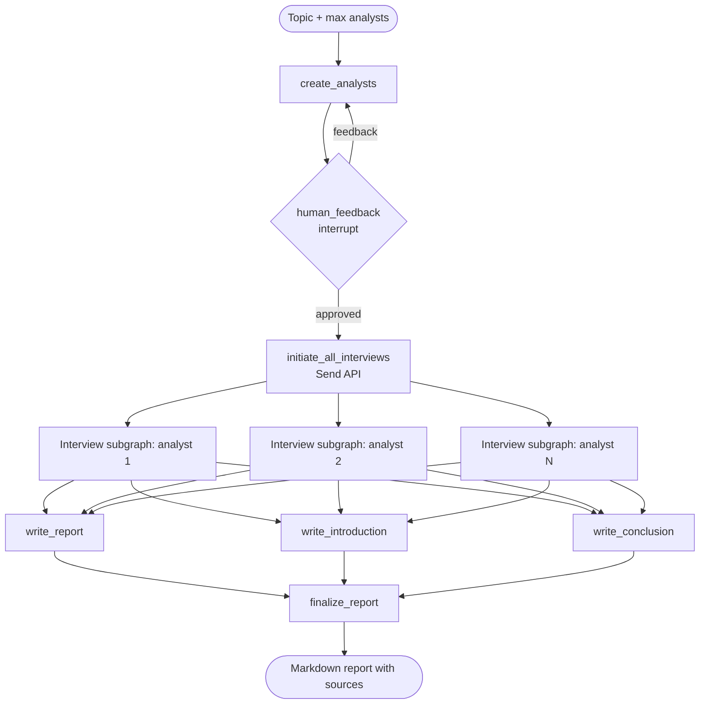
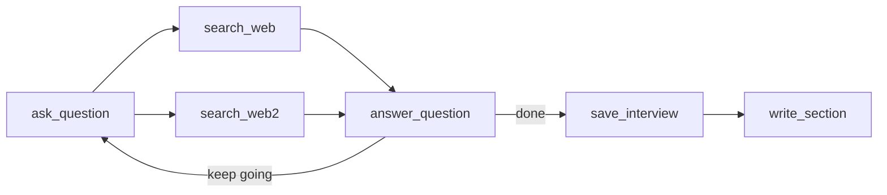

Most "AI research" demos I've seen are a single prompt wrapped around a search call. They work fine for simple questions and fall apart the moment the topic gets broad or technical. I wanted to build something closer to how a real research desk operates: several people with different viewpoints, each doing their own digging, then one clean report at the end.

That's ResearchPilot. You give it a topic, it creates a panel of analyst personas, lets you review them, runs an interview for each analyst in parallel with live web search behind it, and stitches everything into a cited Markdown report.

This post walks through how it's built and why I made the choices I did.

---

## Why a single agent isn't enough

I hit three problems early on with the simple approach.

**One viewpoint.** A single prompt looks at a topic from one angle. If you're researching AI coding agents, a security architect, a finance person and a developer advocate will ask very different questions. One prompt gives you the average of all of them, which is usually the least interesting version.

**Bloated context.** If one agent searches, reads, critiques and rewrites in a loop, the context grows fast. Responses get slower, costs go up, and details from early in the run get lost.

**Ungrounded claims.** When retrieved facts and the model's own memory get mixed in one answer, you end up with statistics that can't be traced back to anything.

My fix was to borrow from how journalists work. An editor decides which angles matter, reporters each take one, and the pieces get assembled at the end.

1. An editor agent reads the topic and creates the analyst personas.
2. A human (me) reviews the panel and can send it back with feedback.
3. Each analyst gets their own interview loop, and all of them run at the same time.
4. In each interview, the analyst questions an expert that has a live search tool.
5. The finished memos get combined into one report with an intro, body, conclusion and sources.

---

## How the graph is laid out

The whole thing is a LangGraph state graph: a parent graph that handles orchestration, and an interview subgraph that runs once per analyst.



Inside each interview subgraph the loop looks like this:



---

## The decisions that mattered

### LangGraph over CrewAI or AutoGen

I tried the higher-level multi-agent frameworks first. They're great for getting something running quickly, but the agents decide a lot on their own, and when a run goes wrong it's hard to tell where. I kept seeing token usage balloon with no clear reason.

LangGraph made me spell out the flow as nodes and edges with an explicit state schema. That gave me three things I ended up relying on constantly:

- The flow is predictable. State only moves along edges I defined.
- Every step is checkpointed, so I can look at the state at any point, rewind and resume.
- `interrupt()` gives a proper way to pause for a human, without a hacked-together `while` loop or global flag.

### Parallel interviews with `Send()`

If interviews run one after another, total time grows with analysts × turns. With 3 analysts and 3 turns each, that's 9 rounds of search plus generation, one after the other. In my runs that meant waiting close to a minute.

With LangGraph's `Send`, each analyst gets their own subgraph run and they all go at once. Total time is roughly the length of the slowest interview. It also means each analyst has a completely separate context, so one analyst's conversation never leaks into another's.

### Reducers for parallel writes

Once branches run in parallel, they finish at different times and each one writes back a report section. If they all write to a plain field, the last one wins and the rest are lost.

The fix is a reducer on the `sections` field:

```python
class ResearchGraphState(TypedDict):
    topic: str
    max_analysts: int
    analysts: List[Analyst]
    sections: Annotated[list, operator.add]  # each branch appends its section
    introduction: str
    content: str
    conclusion: str
    final_report: str
```

With `Annotated[list, operator.add]`, LangGraph concatenates whatever each branch returns, so nothing gets overwritten.

### Groq for inference

Every interview is a chain of calls: build a query, search, answer, ask a follow-up. Multiply that by several analysts and slow generation becomes the main cost. I used `ChatGroq` with `openai/gpt-oss-120b`. Groq's generation speed is high enough that the whole pipeline feels interactive rather than something you start and walk away from.

### Making the expert stay grounded

To keep answers tied to real sources:

- The search query is generated through a structured schema (`SearchQuery`) rather than free text.
- Search results are wrapped in a consistent XML format before they reach the model:

```xml
<Document href="https://example.com/spec">
Document content snippet...
</Document>
```

- The expert prompt says plainly that nothing outside the provided context may be used, and that every claim needs a numbered citation like `[1]`.

---

## How I built it, step by step

### 1. Schemas first

Before writing a single agent node, I defined the data types. Pydantic models make the LLM's structured output fail loudly if it doesn't match.

```python
# src/utils/objects.py
class Analyst(BaseModel):
    name: str = Field(description="Name of the analyst.")
    role: str = Field(description="Role of the analyst in the context of the topic.")
    affiliation: str = Field(description="Primary affiliation of the analyst.")
    description: str = Field(description="Description of the analyst focus, concerns, and motives.")

    @property
    def persona(self) -> str:
        return (
            f"Name: {self.name}\nRole: {self.role}\n"
            f"Affiliation: {self.affiliation}\nDescription: {self.description}\n"
        )

class Perspectives(BaseModel):
    analysts: List[Analyst] = Field(description="Comprehensive list of analysts with their roles and affiliations.")
```

I used three separate state types to keep memory boundaries clear:

- `GenerateAnalystsState` for persona creation and review.
- `InterviewState`, built on `MessagesState`, which holds the conversation plus `context` and `sections`.
- `ResearchGraphState` for the whole run, from topic to final report.

### 2. Generating personas

Vague personas lead to vague research, so `create_analysts` uses structured output and feeds in any feedback from a previous round.

```python
def create_analysts(state: GenerateAnalystsState):
    topic = state['topic']
    max_analysts = state['max_analysts']
    human_analyst_feedback = state.get('human_analyst_feedback', '')

    structured_llm = llm.with_structured_output(Perspectives)
    system_message = analyst_instructions.format(
        topic=topic,
        human_analyst_feedback=human_analyst_feedback,
        max_analysts=max_analysts
    )

    perspectives = structured_llm.invoke([
        SystemMessage(content=system_message),
        HumanMessage(content="Generate the set of analysts.")
    ])

    return {"analysts": perspectives.analysts}
```

### 3. Human in the loop

If the personas miss an important angle, every search and generation call after that is wasted. So the graph stops after persona creation and waits for me.

```python
def human_feedback(state: GenerateAnalystsState):
    feedback = interrupt({
        "question": "Are these analysts okay?",
        "analysts": [
            analyst.model_dump() if hasattr(analyst, "model_dump") else analyst
            for analyst in state.get("analysts", [])
        ],
        "instructions": "Return feedback to regenerate analysts, or return empty/perfect/continue to approve."
    })

    if feedback is None or (isinstance(feedback, str) and feedback.strip().lower() in {"", "perfect", "continue", "approved", "yes"}):
        return {"human_analyst_feedback": None}

    return {"human_analyst_feedback": feedback}
```

The routing after that decides whether to loop back or fan out:

```python
def initiate_all_interviews(state: ResearchGraphState):
    human_analyst_feedback = state.get('human_analyst_feedback')
    if human_analyst_feedback:
        return "create_analysts"

    topic = state["topic"]
    return [
        Send("conduct_interview", {
            "analyst": analyst,
            "messages": [HumanMessage(content=f"So you said you were writing an article on {topic}?")]
        })
        for analyst in state["analysts"]
    ]
```

If there's feedback, it goes back to persona creation. If not, it sends one interview per analyst.

### 4. The interview subgraph

Each interview is a small cyclic agent:

1. `ask_question`: the analyst reads the history and asks the next question, in character.
2. `search_web` and `search_web2`: two search nodes run in parallel and both feed the answer step.
3. `answer_question`: the expert answers using only the retrieved context, with citations.
4. `route_messages`: decides whether to continue or stop. It stops when the turn limit is hit or the analyst says "Thank you so much for your help!"
5. `save_interview` and `write_section`: the transcript becomes a short memo focused on that analyst's angle.

```python
interview_builder = StateGraph(InterviewState)
interview_builder.add_node("ask_question", generate_question)
interview_builder.add_node("search_web", search_web)
interview_builder.add_node("search_web2", search_web2)
interview_builder.add_node("answer_question", generate_answer)
interview_builder.add_node("save_interview", save_interview)
interview_builder.add_node("write_section", write_section)

interview_builder.add_edge(START, "ask_question")
interview_builder.add_edge("ask_question", "search_web")
interview_builder.add_edge("ask_question", "search_web2")
interview_builder.add_edge("search_web", "answer_question")
interview_builder.add_edge("search_web2", "answer_question")
interview_builder.add_conditional_edges("answer_question", route_messages, ['ask_question', 'save_interview'])
interview_builder.add_edge("save_interview", "write_section")
interview_builder.add_edge("write_section", END)
```

### 5. Putting the report together

When all interviews finish, their memos sit in `state["sections"]`. I didn't want to dump them all into one giant prompt and hope for good prose, so the final stage is split in three, and those three run at the same time:

- `write_report` merges the memo bodies into the main themes.
- `write_introduction` reads the memos and writes an intro that previews the findings.
- `write_conclusion` writes the closing section with forward-looking takeaways.

Then `finalize_report` joins them, cleans up the headers, de-duplicates the sources, and outputs the Markdown.

```python
builder = StateGraph(ResearchGraphState)
builder.add_node("create_analysts", create_analysts)
builder.add_node("human_feedback", human_feedback)
builder.add_node("conduct_interview", interview_builder.compile())
builder.add_node("write_report", write_report)
builder.add_node("write_introduction", write_introduction)
builder.add_node("write_conclusion", write_conclusion)
builder.add_node("finalize_report", finalize_report)

builder.add_edge(START, "create_analysts")
builder.add_edge("create_analysts", "human_feedback")
builder.add_conditional_edges("human_feedback", initiate_all_interviews, ["create_analysts", "conduct_interview"])
builder.add_edge("conduct_interview", "write_report")
builder.add_edge("conduct_interview", "write_introduction")
builder.add_edge("conduct_interview", "write_conclusion")
builder.add_edge(["write_conclusion", "write_report", "write_introduction"], "finalize_report")
builder.add_edge("finalize_report", END)

graph = builder.compile()
```

---

## Things that broke along the way

### Interviews that never end

Without a firm stop condition, the simulated analyst and expert just keep thanking each other or drifting into side questions. `route_messages` now has two exits: a hard turn limit (counted by tracking messages where `m.name == "expert"`), and a phrase check. If the analyst says "Thank you so much for your help", the loop ends regardless of how many turns are left.

### Duplicate and made-up citations

In longer runs the model would cite the same URL under two different numbers, or occasionally invent one. Three things helped:

- URLs are pulled straight from the Tavily response, never written by the model.
- The section-writer prompt tells the model to merge references that point to the same URL, so `[3]` and `[4]` become one.
- `finalize_report` isolates each `## Sources` block so duplicates across memos get removed.

### Pydantic objects turning into dicts

When objects pass through `Send` or any serialization boundary, they sometimes arrive as plain dictionaries. That caused `AttributeError: 'dict' object has no attribute 'persona'`. A small guard at the top of the affected nodes fixed it:

```python
analyst = state["analyst"]
if isinstance(analyst, dict):
    analyst = Analyst.model_validate(analyst)
```

---

## Project setup and LangGraph Studio

Dependencies are managed with `uv` through `pyproject.toml`. The `langgraph.json` registers each graph separately:

```json
{
  "dependencies": ["."],
  "graphs": {
    "create_analysts": "./src/agent.py:graph",
    "answer_question": "./src/answering_questions.py:question_answer_graph",
    "deep_agent": "./src/deep_agent.py:graph"
  },
  "env": ".env"
}
```

Registering them separately means I can open just the interview loop in Studio and test it alone, without waiting for the full multi-analyst pipeline each time. LangSmith tracing shows latency and token usage per step, which is how I found most of the problems above.

---

## What I'd do next

- **Evals.** Run RAGAS or DeepEval over a set of research questions to score groundedness, relevance and citation recall, so changes can be measured instead of judged by eye.
- **Caching.** Add a Redis-backed semantic cache for Tavily queries, since analysts on the same topic often search for overlapping things.
- **Private documents.** Put a vector store like Qdrant or Pinecone next to Tavily so analysts can combine internal documents with live web results.
- **Streaming.** Expose the graph through a FastAPI WebSocket endpoint and stream each analyst's interview live into a multi-column view.

---

## Closing thoughts

The biggest lesson from this project is that good agent behavior comes less from clever prompts and more from the structure around them: explicit state, isolated contexts, parallel execution where it's safe, and a human checkpoint before anything expensive happens. Once those were in place, the prompts got a lot simpler.